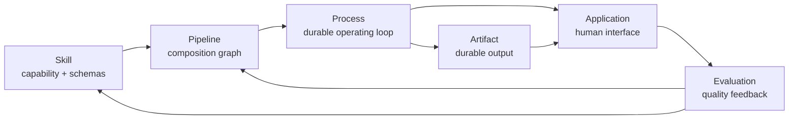
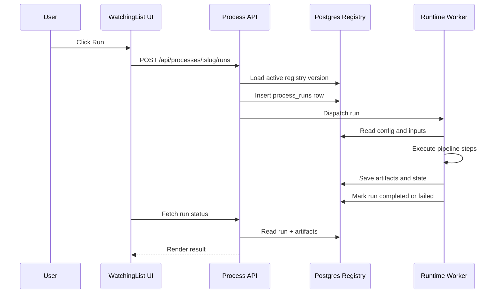
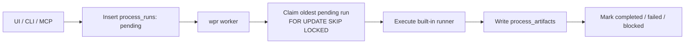
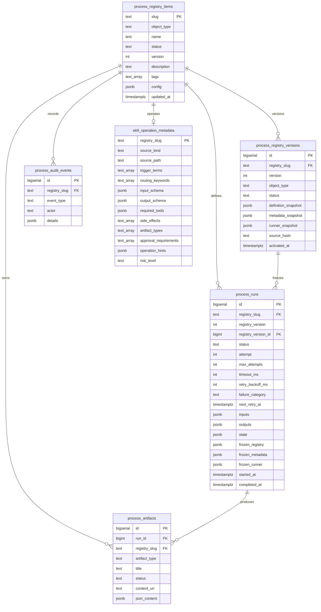
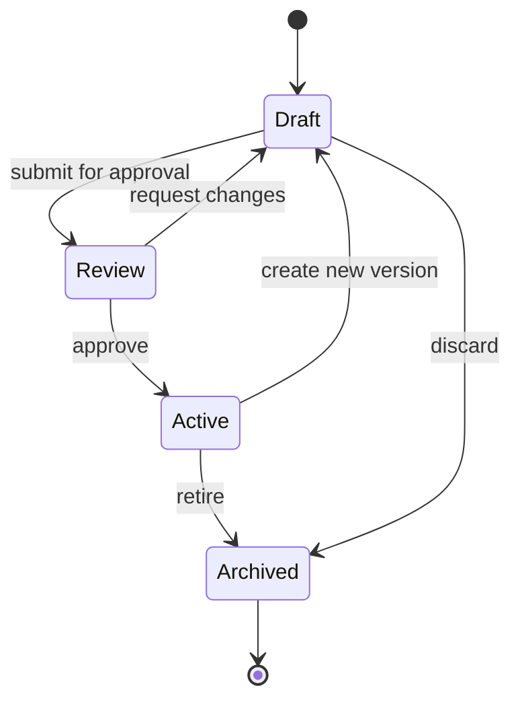
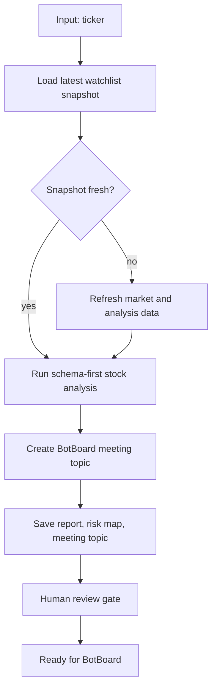
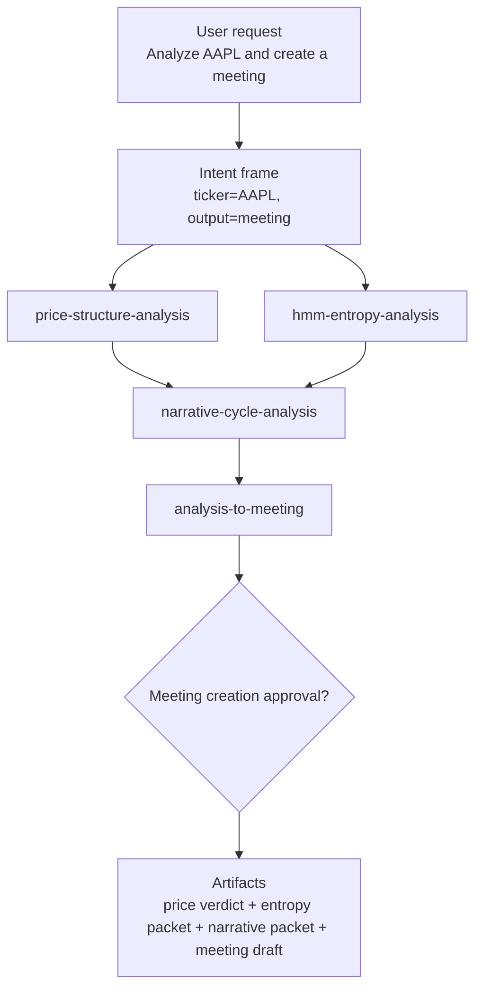

# Process Registry Architecture

WatchingList can treat database rows as the operating layer for skills, pipelines, processes, and applications. The database stores executable intent; the app and workers interpret that intent into UI, runs, artifacts, approvals, and audit history.

## Core Idea

The registry turns operational knowledge into versioned data:

- **Skills** define typed capabilities.
- **Pipelines** compose skills into ordered or conditional graphs.
- **Processes** make pipelines durable with state, triggers, approvals, and memory.
- **Applications** expose processes and artifacts through UI surfaces.
- **Templates** instantiate reusable process systems from a small input form.

## Data-Driven OS Analogy

The Process Registry is a data-driven operating system for AI skills. A skill is no longer only a prompt or a file on disk. Inside WPR, a skill behaves like an OS API: it has an identity, a typed function signature, permission/risk metadata, an execution strategy, a durable process row, durable outputs, and an audit trail.

```text
Skill definition -> DB registry row       identity + lifecycle
Schema           -> validation            legal inputs / function signature
Runner kind      -> execution strategy    generic, bespoke, pipeline, gated
Run row          -> queue                 durable process state
Artifact row     -> durable output        packet, report, decision, media
Audit row        -> observability         who / what / when / why
```

In OS terms:

```text
Skill                  = API capability
input_schema           = function signature / syscall args
risk_level             = permission tier
approval_requirements  = user consent / privilege gate
process_runs           = process table / job queue
runner                 = implementation
process_artifacts      = return values / files
process_audit_events   = logs
status                 = enabled/disabled lifecycle
```

The kernel-like WPR contract is:

```text
validate args
check risk
choose runner
execute or create invocation packet
persist outputs
expose artifacts
record audit events
```

That makes the system scalable. Adding the next skill does not require redesigning the app. The new skill needs a registry row, an input schema, and a runner strategy. It can start with a safe generic runner, then graduate to a bespoke runner, then become part of a pipeline while keeping the same registry identity.

```text
generic runner -> invocation packet
bespoke runner -> workflow-specific artifact
pipeline runner -> multi-step operating loop
```

The core idea is to turn skills from loose prompt magic into typed, inspectable, runnable infrastructure. Each new capability should enter the system through the same durable path:

```text
new skill
-> typed contract
-> risk/approval policy
-> runner strategy
-> durable run
-> artifact
-> audit trail
```

That is how WPR becomes an operating layer instead of a folder of scripts.

## Operations Checklist

Use this checklist when changing WPR:

```text
1. Define or update the skill source.
2. Import/sync into the DB registry.
3. Confirm input_schema and output_schema.
4. Confirm runner_config and retry policy.
5. Confirm risk_level and approval_requirements.
6. Confirm immutable version snapshot.
7. Run deterministic planner or path resolver.
8. Create a run or enqueue for worker.
9. Inspect artifacts in the inbox.
10. Approve, publish, archive, retry, or fix.
```

Minimal health commands:

```bash
wpr list --type skill --status active
wpr audit-skills
wpr plan "Analyze AAPL and create a meeting"
wpr plan "Analyze AAPL and create a meeting" --llm
wpr versions price-structure-analysis 5
wpr runs price-structure-analysis 5
wpr artifacts price-structure-analysis 5
```

## Runner Taxonomy

WPR uses runner kinds to decide what execution is allowed and what artifact contract to expect.

```text
read-only analysis runner
  No external side effects. Produces reports, scores, classifications, or decision memos.

python script runner
  Calls a declared Python entrypoint with typed args. Captures stdout, JSON, and declared file outputs.

node script runner
  Calls a declared Node entrypoint. Useful for app-local TypeScript/JavaScript utilities.

browser automation runner
  Uses browser automation for UI workflows, screenshots, web extraction, and NotebookLM-style flows.

notebook/video runner
  Handles long-running media and research pipelines. Produces decks, audio, video, thumbnails, and metadata.

approval-gated external action runner
  Can post, upload, create, send, trade, or mutate external systems only after approval gates pass.

generic skill runner
  Safe baseline for imported skills without bespoke automation. Produces a skill_invocation_packet artifact with skill metadata, typed inputs, source path, and source preview. It does not execute external side effects.
```

The durable design rule:

```text
runner_kind determines execution permissions
risk_level determines review policy
input_schema determines allowed args
artifact_types determine output contracts
output_schema validates artifact JSON
```

Example:

```json
{
  "runner_kind": "python_script",
  "entrypoint": "scripts/distill.py",
  "input_schema": {
    "type": "object",
    "properties": {
      "slug": {"type": "string"}
    },
    "required": ["slug"]
  },
  "artifact_types": ["polymarket_distillation"],
  "approval_requirements": []
}
```



## Runtime Loop

The first runtime should stay small: load an active registry object, validate inputs, create a run row, execute steps, persist artifacts, and update status.



Long workflows should run through the worker, not inside a Next.js request:



## Data Model

The current schema gives WPR a registry, immutable version ledger, run queue, artifact store, audit trail, and skill-operation metadata.

WPR-related migrations:

```text
002_process_registry.sql
003_skill_operation_metadata.sql
004_skill_input_schemas.sql
005_generic_skill_wpr_schema.sql
006_runner_configs_and_output_schemas.sql
007_run_policy_and_versions.sql
008_process_registry_versions.sql
```

`001_financials_history.sql` is separate from WPR. It supports financial metric history and Watson as-of revenue calculations.



## Object Lifecycle

Registry objects should behave like code. Agent-created or human-edited definitions begin as drafts, move through review, and only active versions can run.



## Example: Stock To Meeting



## Current Implementation

The app now has:

- `/processes` registry dashboard
- `/api/processes` JSON endpoint
- `/processes/runs` run history
- `/processes/runs/[id]` run detail
- `/processes/artifacts` artifact inbox
- `POST /api/processes/artifacts/[id]` artifact status updates
- `POST /api/processes/runs/[id]/retry` manual retry for failed or blocked runs
- `process_registry_items` seed objects
- `process_registry_versions` immutable version snapshots
- `skill_operation_metadata` routing and operation table
- `process_runs`, `process_artifacts`, and `process_audit_events` tables
- `process_runs.registry_version_id` links each run to an immutable registry version
- `process_runs.frozen_registry`, `frozen_metadata`, and `frozen_runner` preserve the exact execution contract
- URL-addressable action panel for run, edit, review, and run history previews
- WPR MCP path routing for commands such as `wpr/aapl/price structure`
- WPR CLI for local operation suggestions, run creation, run triggering, and artifact lookup
- `wpr audit-skills` and `wpr audit-skills --run-all` to verify schema, runner, and artifact readiness
- `wpr plan` deterministic task planner
- `wpr plan --llm` optional OpenAI planner refinement
- `wpr versions` immutable version inspection
- Typed input schemas for all imported skills
- Typed output schemas for artifact validation
- DB-backed runner config in `skill_operation_metadata.operation_hints.runner_config`
- Retry, timeout, backoff, and failure-category policy on every run
- Safe generic WPR runner for skills without bespoke automation
- Built-in artifact-producing runners for `price-structure-analysis`, `polymarket-distiller`, and `us-portfolio-construction`

Current bespoke executors:

```text
price-structure-analysis -> price_structure_verdict artifact
polymarket-distiller     -> polymarket_distillation artifact
us-portfolio-construction -> portfolio_allocation artifact
```

All other active skills are runnable through the generic safe runner, which creates a `skill_invocation_packet` artifact rather than executing the full external workflow.

## WPR Path Syntax

WPR can resolve compact operation paths:

```text
wpr/<data-input>/<operation-query>
```

Examples:

```text
wpr/aapl/price structure
wpr/aapl/hmm entropy
wpr/tsla/trendwise
```

The resolver parses the data input, detects whether it looks like a ticker, checks the latest watchlist row when available, then matches the operation query against `skill_operation_metadata`. If the matched skill is active, WPR can create a pending run. Skills with bespoke runners produce workflow-specific artifacts. Skills without bespoke automation use the safe generic runner and produce `skill_invocation_packet` artifacts.

## WPR CLI

The CLI wraps the same operation handlers used by the MCP server:

```bash
npm run wpr -- AAPL
npm run wpr -- META price structure
npm run wpr -- META price structure --create
npm run wpr -- META price structure --run
npm run wpr -- plan "Analyze AAPL and create a meeting"
npm run wpr -- plan "Analyze AAPL and create a meeting" --llm
npm run wpr -- run 3
npm run wpr -- runs price-structure-analysis 10
npm run wpr -- artifacts price-structure-analysis 5
npm run wpr -- metadata price-structure-analysis
npm run wpr -- versions price-structure-analysis 5
npm run wpr -- audit-skills
npm run wpr -- audit-skills --run-all
```

Direct script usage also works:

```bash
./scripts/wpr-cli.mjs AAPL
./scripts/wpr-cli.mjs path "wpr/aapl/price structure" --run
```

Long-running workflows can be handled by the Postgres-backed worker:

```bash
wpr worker
wpr worker --once
npm run wpr:worker -- --once
```

The worker claims pending rows from `process_runs`, marks them `running`, executes the matching runner, writes artifacts, and marks the run `completed`, `failed`, or `blocked`.

## MCP Tool Surface

The WPR MCP server exposes the same DB-backed operations used by the CLI:

```text
list_process_registry
get_process_registry_item
get_skill_operation_metadata
list_process_registry_versions
create_process_run
trigger_process_run
list_process_runs
list_process_artifacts
suggest_data_operations
resolve_operation_path
suggest_task_plan
import_skills_from_directory
audit_process_registry_skills
```

Shorthand MCP-style paths are resolved by `resolve_operation_path`:

```text
wpr/aapl
wpr/aapl/price structure
wpr/600519.ss/polymarket-distiller
```

The important invariant: MCP calls are DB operations and deterministic runner dispatch unless `suggest_task_plan` is explicitly called with `use_llm: true`.

## Bot-Facing WPR Bridge

Remote Hermes agents can use WPR without installing the full WatchingList app by calling the authenticated bridge:

```text
POST /api/wpr/bridge
Authorization: Bearer $WPR_BRIDGE_TOKEN
Content-Type: application/json

{"args":["plan","Analyze AAPL and create a meeting"]}
```

The bridge runs the same WPR CLI surface on the server and returns plain text. It is read-only by default: `suggest`, `path`, `plan`, `metadata`, `versions`, `runs`, and `artifacts` are allowed. `--run` and `--create` are blocked unless `WPR_BRIDGE_ALLOW_RUN=true` on the server and the request explicitly sets `allow_run:true`.

The BotBoard Hermes helper uses this bridge when `WPR_BRIDGE_URL` and `WPR_BRIDGE_TOKEN` are present on the bot server:

```bash
python3 /root/wpr_bot_tool.py plan "Analyze AAPL and create a meeting"
python3 /root/wpr_bot_tool.py path "wpr/aapl/price structure"
python3 /root/wpr_bot_tool.py artifacts price-structure-analysis 10
```

## Run Detail And Artifact Inbox

WPR artifacts should be inspectable operational objects, not hidden log output. The app exposes:

```text
/processes/runs
/processes/runs/[id]
/processes/artifacts
```

Run detail shows the frozen registry version, frozen skill metadata, frozen runner config, inputs, outputs, runtime state, retry policy, artifacts, and audit events. The artifact inbox shows durable outputs across runs and lets the operator move artifacts through:

```text
needs_review -> approved -> published -> archived
```

Status changes write `process_audit_events`, so approval and publication decisions are observable.

## Retry, Timeout, And Failure Policy

Every run now carries runner policy fields copied from the runner config at creation time:

```text
attempt
max_attempts
timeout_ms
retry_backoff_ms
failure_category
next_retry_at
```

Workers only claim pending runs whose `next_retry_at` is due. Retryable failures such as timeouts, market-data failures, external runner failures, and unknown transient failures can be rescheduled with backoff. Deterministic failures such as validation errors, artifact schema errors, or missing runners fail or block without retry churn.

Runner config lives in `skill_operation_metadata.operation_hints.runner_config`:

```json
{
  "runner_kind": "built_in",
  "executor": "price_structure_analysis",
  "artifact_type": "price_structure_verdict",
  "timeout_ms": 120000,
  "max_attempts": 2,
  "retry_backoff_ms": 5000,
  "env_policy": "process"
}
```

Failure categories:

```text
timeout
validation
artifact_schema
no_runner
market_data
external_runner
unknown
```

Retryable categories:

```text
timeout
market_data
external_runner
unknown
```

## Version Immutability

The current registry row is an active pointer. Immutable history lives in `process_registry_versions`:

```text
process_registry_items
  slug = current active pointer
  version = latest current version

process_registry_versions
  registry_slug
  version
  definition_snapshot
  metadata_snapshot
  runner_snapshot
  source_hash
```

If a skill is modified several times, WPR mints `v1`, `v2`, `v3`, and so on. Imports and run creation ensure a version snapshot exists. If a DB row is edited without bumping `version`, WPR detects the changed snapshot hash and advances the current row to the next version before creating a run.

Each `process_runs` row points to the immutable version and also freezes the exact executable contract used by that run:

```text
registry_version_id
frozen_registry
frozen_metadata
frozen_runner
```

This makes artifacts reproducible even after a skill definition, input schema, output schema, or runner config changes. Execution prefers the frozen snapshots on the run row, while new runs pick up the latest active registry metadata.

Useful inspection command:

```bash
wpr versions price-structure-analysis 5
```

### Editing A Skill In DB

Treat DB edits as changes to the current active pointer, not as historical rewrites:

```text
edit registry row or metadata
-> WPR computes snapshot hash
-> if hash differs from current version snapshot, WPR increments version
-> WPR inserts process_registry_versions row
-> new process_runs point to the new registry_version_id
-> old runs keep their frozen snapshots
```

That means a skill modified several times becomes:

```text
hmm-entropy-analysis v1
hmm-entropy-analysis v2
hmm-entropy-analysis v3
```

Past artifacts remain reproducible because every run stores:

```text
registry_version_id
frozen_registry
frozen_metadata
frozen_runner
```

Operational rule:

```text
Do not mutate historical process_registry_versions rows.
Create or let WPR mint a new version for behavior/schema/runner changes.
```

## Task Composition Layer

The next layer above individual skills is a task composer: given a user request, WPR selects relevant skills as building blocks, compiles them into a typed plan, optionally executes the safe artifact-producing blocks, and writes a final synthesis artifact.

```text
user input
-> intent frame
-> candidate skills
-> typed execution plan
-> run graph
-> artifacts
-> synthesis / answer
```

This layer is not a free-form agent loop. It is a compiler over the skill registry. The registry already knows each skill's schema, risk level, runner kind, artifact contract, and approval policy. The composer uses that data to build a safe plan.

Current MVP:

```bash
npm run wpr -- plan "Analyze AAPL and create a meeting"
npm run wpr -- plan "Analyze AAPL and create a meeting" --run
npm run wpr -- plan "AAPL shannon entropy analysis" --json
```

The MCP tools behind the CLI are:

```text
suggest_task_plan  -> plan only
execute_task_plan  -> plan, execute safe blocks, collect artifacts, synthesize final artifact
```

`suggest_task_plan` parses intent, ranks active skill rows from Postgres, maps inputs against each skill schema, validates the proposed inputs, summarizes risk and approval gates, and returns recommended skill graphs.

`execute_task_plan` selects the executable plan, creates child `process_runs`, triggers each safe built-in or generic runner, collects the child `process_artifacts`, and writes one durable `task_synthesis` artifact. It does not perform external publish/upload/trade side effects.

### Optional LLM Planner

Default WPR planning is deterministic. LLM support is explicit:

```bash
wpr plan "Analyze AAPL and create a meeting" --llm
wpr plan "Analyze AAPL and create a meeting" --llm --provider openai --model gpt-4.1-mini
```

The deterministic planner still runs first. The LLM receives only the user intent, parsed intent, candidate skill metadata, and deterministic plans. Its response is sanitized so it can only choose real active skill slugs from the candidate list. The returned object includes:

```text
llm.enabled
llm.provider
llm.model
llm.status
llm.plan
llm.usage
```

Configuration:

```text
OPENAI_API_KEY=...
WPR_LLM_PROVIDER=openai | compatible
WPR_LLM_MODEL=gpt-4.1-mini
WPR_LLM_BASE_URL=https://api.openai.com/v1
WPR_LLM_API_KEY=...
WPR_LLM_TIMEOUT_MS=30000
```

If `WPR_LLM_API_KEY` is empty, WPR falls back to `OPENAI_API_KEY`. `OPENROUTER_API_KEY` is intentionally ignored because that route is blocked in this environment. LLM planning writes a `process_audit_events` row with provider, model, input, and selected slugs. Secrets are never written to audit rows.

### Running Recommended Block Graphs

The operator can inspect the plan:

```bash
wpr plan "Analyze AAPL and create a meeting"
```

Then execute safe blocks and synthesize the final result:

```bash
wpr plan "Analyze AAPL and create a meeting" --run
```

This creates:

```text
child process_runs        one per selected skill block
child process_artifacts   one or more per selected block
task_synthesis artifact   integrated final result
process_audit_events      task_plan_executed trace
```

Operators can still run selected blocks manually:

```bash
wpr AAPL price structure --run
wpr AAPL hmm entropy analysis --run
wpr AAPL narrative cycle analysis --run
wpr AAPL analysis to meeting --run
```

Or create pending runs and let the worker process them:

```bash
wpr AAPL price structure --create
wpr AAPL hmm entropy analysis --create
wpr AAPL narrative cycle analysis --create
wpr AAPL analysis to meeting --create

wpr worker
```

Only skills with real executors produce true domain artifacts. `price-structure-analysis`, `polymarket-distiller`, and `us-portfolio-construction` have built-in runners. Other active skills currently use the generic WPR runner, which creates a durable `skill_invocation_packet` artifact that records the selected skill, typed inputs, metadata, and source preview.

Portfolio construction is now a first-class WPR block:

```bash
wpr plan "Build a 25 stocks portfolio from US"
wpr plan "Build a 25 stocks portfolio from US" --run
```

The intent parser maps this to `task_type=portfolio_construction`, extracts `market=US` and `max_holdings=25`, validates the arguments against the skill schema, runs the BotBoard US watchlist allocator, normalizes raw model weights to 100% of the selected capital base, and writes a durable `portfolio_allocation` artifact. The artifact is a model allocation for review, not a trade order or personal financial advice.

Current `wpr plan "..." --run` is synchronous and conservative: it executes safe built-in or generic artifact runners, then synthesizes from completed artifacts. The next upgrade is to persist task graphs as first-class records and let workers execute runnable nodes in DAG order while respecting schema validation and approval gates.

### Composition Components

```text
Intent Parser
  Extracts entities, task type, constraints, desired outputs, urgency, and side-effect tolerance.

Skill Selector
  Searches skill_operation_metadata trigger terms, routing keywords, artifact types, required tools, and previous success history.

Plan Builder
  Chooses a small set of skills and orders them as a DAG: fetch -> analyze -> compare -> synthesize -> publish.

Argument Mapper
  Converts user input and upstream artifacts into each skill's input_schema.

Risk Gate
  Blocks or pauses plan nodes whose risk_level or approval_requirements exceed the current permission.

Graph Executor
  Creates process_runs for each node, tracks dependencies, and lets workers claim runnable nodes.

Artifact Synthesizer
  Reads process_artifacts from completed nodes and produces the final answer, report, meeting topic, or media package.

Evaluator
  Scores whether the artifact set satisfied the original intent and records quality signals for future routing.
```

### Building Block Model

Every skill becomes a typed block:

```json
{
  "slug": "hmm-entropy-analysis",
  "inputs": {"ticker": "AAPL"},
  "outputs": ["regime_report", "decision_memo"],
  "runner_kind": "generic",
  "risk_level": "medium",
  "approval_requirements": ["human_review"]
}
```

The task composer can wire blocks together when one block's artifact contract can satisfy another block's input schema.

```text
artifact.output.symbol -> next.inputs.ticker
artifact.output.summary_md -> next.inputs.context
artifact.output.report_uri -> next.inputs.source_doc
```

### Example: "Analyze AAPL And Create A Meeting"



### Proposed Data Model

The composer should persist plans as first-class process objects, not transient chat state.

```text
task_plans
  id
  user_input
  intent_frame jsonb
  status
  risk_summary jsonb
  created_at

task_plan_nodes
  id
  task_plan_id
  registry_slug
  runner_kind
  inputs jsonb
  depends_on bigint[]
  process_run_id
  status

task_plan_edges
  id
  task_plan_id
  from_node_id
  to_node_id
  artifact_selector jsonb
  input_mapping jsonb
```

### Planning Contract

The planner should output a typed plan before execution:

```json
{
  "intent": {
    "task_type": "stock_research_to_meeting",
    "entities": {"ticker": "AAPL"},
    "desired_artifacts": ["decision_memo", "meeting_topic"]
  },
  "nodes": [
    {
      "id": "price",
      "slug": "price-structure-analysis",
      "inputs": {"ticker": "AAPL"}
    },
    {
      "id": "entropy",
      "slug": "hmm-entropy-analysis",
      "inputs": {"ticker": "AAPL"}
    },
    {
      "id": "meeting",
      "slug": "analysis-to-meeting",
      "depends_on": ["price", "entropy"],
      "inputs_from_artifacts": true
    }
  ],
  "approval_gates": ["before_meeting_creation"]
}
```

### Execution Rule

The task layer should compose aggressively but execute conservatively:

```text
select many candidates
choose few blocks
validate every input
respect every risk gate
write every intermediate artifact
never hide failed nodes
synthesize only from completed artifacts
```

This gives WPR the feeling of a block-based OS: skills are small APIs, artifacts are typed files, runs are processes, and the task composer is the scheduler/compiler that turns user intent into a runnable program.

## Import Discipline

New skills imported into WPR should fit the OS contract immediately:

1. Create or update the skill definition in the source skill directory.
2. Import the skill into `process_registry_items`.
3. Store `skill_operation_metadata` with concrete `input_schema` and `output_schema`.
4. Assign a runner strategy:
   - generic runner by default
   - bespoke runner when a real executable workflow exists
   - approval-gated runner for external side effects
5. Store runner policy in `operation_hints.runner_config`.
6. Mint or update `process_registry_versions`.
7. Verify with `wpr audit-skills`.
8. For executable coverage, run `wpr audit-skills --run-all` and confirm every skill creates at least one artifact.

Recommended command flow:

```bash
wpr import-skills ~/.codex/skills
wpr metadata <skill-slug>
wpr versions <skill-slug> 5
wpr audit-skills
wpr audit-skills --run-all
```

For skills edited in `~/.cursor/skills`, follow the workspace skill sync rule first, then import into WPR:

```bash
python3 /Users/sdg223157/botboard-private/scripts/sync_skills.py
wpr import-skills ~/.codex/skills
```

## Next Steps

1. Add `task_plans`, `task_plan_nodes`, and `task_plan_edges` for first-class graph execution.
2. Move `wpr plan "..." --run` from synchronous execution to worker-backed DAG scheduling.
3. Add approval queue objects for risky nodes before external upload/post/trade actions.
4. Add bespoke runner classes for Python script, Node script, browser automation, notebook/video, and external-action workflows.
5. Upgrade the artifact synthesizer from deterministic markdown assembly to schema-aware synthesis per final artifact type.
6. Add evaluator signals: artifact quality score, human edit distance, rerun reason, and user approval outcome.
7. Add UI run creation from `/processes` so operators can create runs without CLI/MCP.
