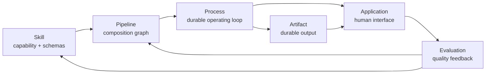
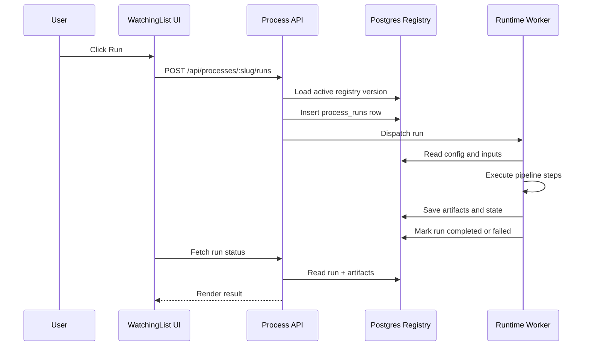
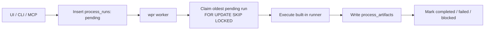
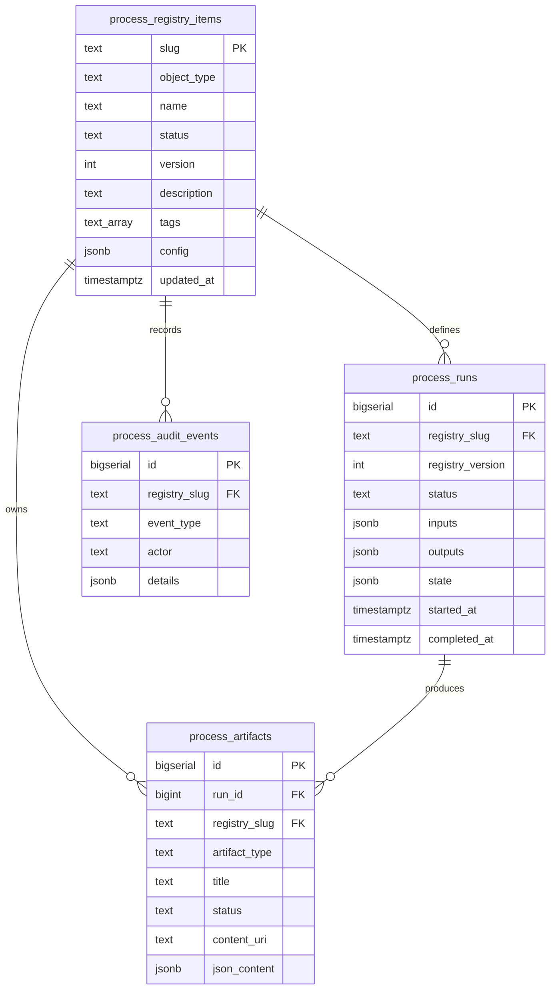
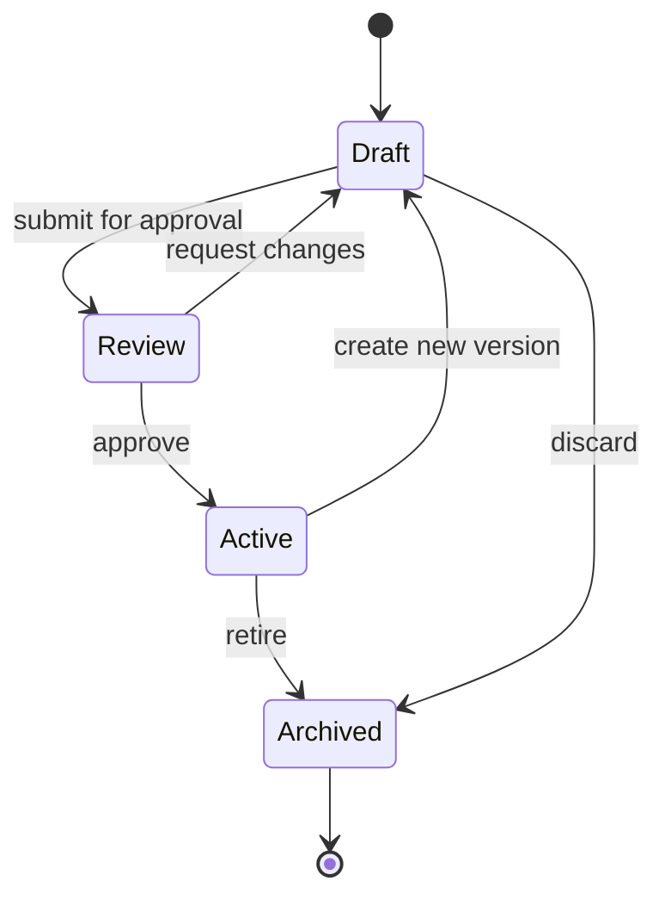
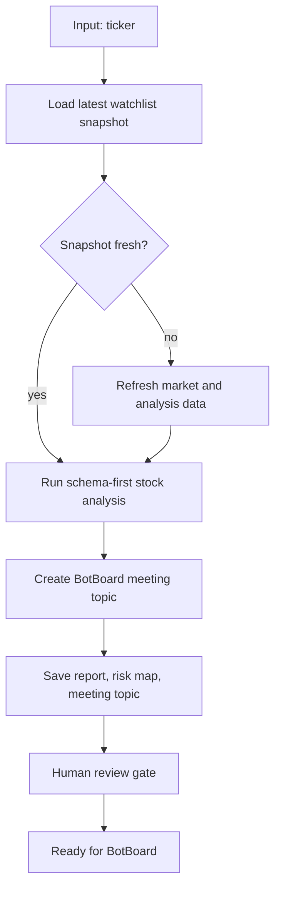

# Process Registry Architecture

WatchingList can treat database rows as the operating layer for skills, pipelines, processes, and applications. The database stores executable intent; the app and workers interpret that intent into UI, runs, artifacts, approvals, and audit history.

## Core Idea

The registry turns operational knowledge into versioned data:

- **Skills** define typed capabilities.
- **Pipelines** compose skills into ordered or conditional graphs.
- **Processes** make pipelines durable with state, triggers, approvals, and memory.
- **Applications** expose processes and artifacts through UI surfaces.
- **Templates** instantiate reusable process systems from a small input form.

## Data-Driven OS Analogy

The Process Registry is a data-driven operating system for AI skills. A skill is no longer only a prompt or a file on disk. Inside WPR, a skill behaves like an OS API: it has an identity, a typed function signature, permission/risk metadata, an execution strategy, a durable process row, durable outputs, and an audit trail.

```text
Skill definition -> DB registry row       identity + lifecycle
Schema           -> validation            legal inputs / function signature
Runner kind      -> execution strategy    generic, bespoke, pipeline, gated
Run row          -> queue                 durable process state
Artifact row     -> durable output        packet, report, decision, media
Audit row        -> observability         who / what / when / why
```

In OS terms:

```text
Skill                  = API capability
input_schema           = function signature / syscall args
risk_level             = permission tier
approval_requirements  = user consent / privilege gate
process_runs           = process table / job queue
runner                 = implementation
process_artifacts      = return values / files
process_audit_events   = logs
status                 = enabled/disabled lifecycle
```

The kernel-like WPR contract is:

```text
validate args
check risk
choose runner
execute or create invocation packet
persist outputs
expose artifacts
record audit events
```

That makes the system scalable. Adding the next skill does not require redesigning the app. The new skill needs a registry row, an input schema, and a runner strategy. It can start with a safe generic runner, then graduate to a bespoke runner, then become part of a pipeline while keeping the same registry identity.

```text
generic runner -> invocation packet
bespoke runner -> workflow-specific artifact
pipeline runner -> multi-step operating loop
```

## Runner Taxonomy

WPR uses runner kinds to decide what execution is allowed and what artifact contract to expect.

```text
read-only analysis runner
  No external side effects. Produces reports, scores, classifications, or decision memos.

python script runner
  Calls a declared Python entrypoint with typed args. Captures stdout, JSON, and declared file outputs.

node script runner
  Calls a declared Node entrypoint. Useful for app-local TypeScript/JavaScript utilities.

browser automation runner
  Uses browser automation for UI workflows, screenshots, web extraction, and NotebookLM-style flows.

notebook/video runner
  Handles long-running media and research pipelines. Produces decks, audio, video, thumbnails, and metadata.

approval-gated external action runner
  Can post, upload, create, send, trade, or mutate external systems only after approval gates pass.

generic skill runner
  Safe baseline for imported skills without bespoke automation. Produces a skill_invocation_packet artifact with skill metadata, typed inputs, source path, and source preview. It does not execute external side effects.
```

The durable design rule:

```text
runner_kind determines execution permissions
risk_level determines review policy
input_schema determines allowed args
artifact_types determine output contracts
```

Example:

```json
{
  "runner_kind": "python_script",
  "entrypoint": "scripts/distill.py",
  "input_schema": {
    "type": "object",
    "properties": {
      "slug": {"type": "string"}
    },
    "required": ["slug"]
  },
  "artifact_types": ["polymarket_distillation"],
  "approval_requirements": []
}
```



## Runtime Loop

The first runtime should stay small: load an active registry object, validate inputs, create a run row, execute steps, persist artifacts, and update status.



Long workflows should run through the worker, not inside a Next.js request:



## Data Model

The current migration creates the minimum useful backbone.



## Object Lifecycle

Registry objects should behave like code. Agent-created or human-edited definitions begin as drafts, move through review, and only active versions can run.



## Example: Stock To Meeting



## Current Implementation

The app now has:

- `/processes` registry dashboard
- `/api/processes` JSON endpoint
- `process_registry_items` seed objects
- `skill_operation_metadata` routing and operation table
- `process_runs`, `process_artifacts`, and `process_audit_events` tables
- URL-addressable action panel for run, edit, review, and run history previews
- WPR MCP path routing for commands such as `wpr/aapl/price structure`
- WPR CLI for local operation suggestions, run creation, run triggering, and artifact lookup
- `wpr audit-skills` and `wpr audit-skills --run-all` to verify schema, runner, and artifact readiness
- Typed input schemas for all imported skills
- Safe generic WPR runner for skills without bespoke automation
- Built-in artifact-producing runners for `price-structure-analysis` and `polymarket-distiller`

## WPR Path Syntax

WPR can resolve compact operation paths:

```text
wpr/<data-input>/<operation-query>
```

Examples:

```text
wpr/aapl/price structure
wpr/aapl/hmm entropy
wpr/tsla/trendwise
```

The resolver parses the data input, detects whether it looks like a ticker, checks the latest watchlist row when available, then matches the operation query against `skill_operation_metadata`. If the matched skill is active, WPR can create a pending run. Skills with bespoke runners produce workflow-specific artifacts. Skills without bespoke automation use the safe generic runner and produce `skill_invocation_packet` artifacts.

## WPR CLI

The CLI wraps the same operation handlers used by the MCP server:

```bash
npm run wpr -- AAPL
npm run wpr -- META price structure
npm run wpr -- META price structure --create
npm run wpr -- META price structure --run
npm run wpr -- run 3
npm run wpr -- artifacts price-structure-analysis 5
npm run wpr -- metadata price-structure-analysis
npm run wpr -- audit-skills
npm run wpr -- audit-skills --run-all
```

Direct script usage also works:

```bash
./scripts/wpr-cli.mjs AAPL
./scripts/wpr-cli.mjs path "wpr/aapl/price structure" --run
```

Long-running workflows can be handled by the Postgres-backed worker:

```bash
wpr worker
wpr worker --once
npm run wpr:worker -- --once
```

The worker claims pending rows from `process_runs`, marks them `running`, executes the matching runner, writes artifacts, and marks the run `completed`, `failed`, or `blocked`.

## Import Discipline

New skills imported into WPR should fit the OS contract immediately:

1. Create or update the skill definition in the source skill directory.
2. Import the skill into `process_registry_items`.
3. Store `skill_operation_metadata` with a concrete `input_schema`.
4. Assign a runner strategy:
   - generic runner by default
   - bespoke runner when a real executable workflow exists
   - approval-gated runner for external side effects
5. Verify with `wpr audit-skills`.
6. For executable coverage, run `wpr audit-skills --run-all` and confirm every skill creates at least one artifact.

## Next Steps

1. Add `POST /api/processes/:slug/runs` to create a real `process_runs` row from the web app.
2. Add a run detail page at `/processes/runs/:id`.
3. Add an artifact inbox view backed by `process_artifacts`.
4. Add immutable version tables before allowing production edits.
5. Add approval actions that write `process_audit_events`.
6. Add runner-class config for Python, Node, browser automation, notebook/video, and approval-gated external actions.
